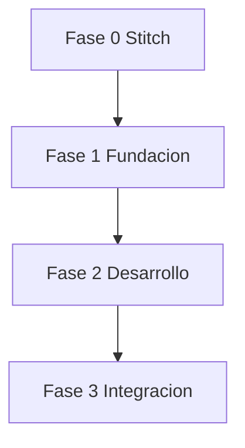

# Plan Maestro

## Objetivo

Construir la solucion integral del laboratorio (app y propuesta web) en el repositorio `https://github.com/Sacariel76/diceProject.git`, con flujo disciplinado de ramas, PRs y trazabilidad en Trello.

> [!note] Alcance tecnico actual
> El proyecto inicia desde una base Flutter funcional de prueba con WebSocket.
>
> - Entrada actual: `lib/main.dart`
> - Servicio de red: `lib/services/websocket_service.dart`

## Fases

### Fase 0 - Diseno (Stitch Google AI)

- Definir user flow completo: Inicio -> Crear/Unirse sala -> Lobby -> Mesa -> Resultados.
- Crear mockups mobile y web en Stitch.
- Aprobar version visual `v1` por todo el equipo.
- Convertir cada pantalla aprobada a Issues tecnicos.

> [!tip] Entregable
> Un set de mockups aprobado y enlazado desde [[04-Flujo-Trello]].

### Fase 1 - Fundacion tecnica

- Estandarizar estructura de modulos y convenciones de codigo.
- Definir contrato de eventos WebSocket (nombres, payloads y errores).
- Configurar etiquetas y plantillas de Issues/PR en GitHub.

### Fase 2 - Desarrollo modular

- Implementar modulo de reglas y puntajes del juego.
- Implementar flujo online en tiempo real (salas, turnos, sincronizacion).
- Implementar pantallas y componentes siguiendo Stitch v1.

### Fase 3 - Integracion y cierre

- QA funcional cruzada y correccion de errores criticos.
- Ajustes de UX y estabilidad de conexion.
- Documentacion final y demo.

## Definition of Done (DoD)

- Issue asignado a un unico responsable.
- Cambios subidos en branch personal.
- PR con descripcion clara y checklist completado.
- Al menos 1 aprobacion de otro integrante.
- Pruebas basicas ejecutadas en local (cuando aplique).
- Tarjeta Trello movida a `Done` con link al PR cerrado.

## Dependencias entre fases

Ver tambien: [[02-Asignacion-Modulos]] y [[03-Flujo-GitHub]].
