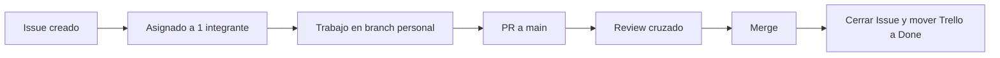

# Flujo GitHub

> [!warning] Regla del curso
> Cada miembro usa su propio branch. No se sube codigo directo a `main`.

## Branches oficiales del equipo

- `dev/LoesssLR`
- `dev/SebastianRodMes`
- `dev/Sacariel76`

## Flujo por tarea

1. Crear Issue en GitHub con descripcion y criterios de aceptacion.
2. Asignar 1 integrante (assignee unico).
3. Desarrollar en el branch personal del assignee.
4. Abrir PR hacia `main` con referencia al Issue (`Closes #ID`).
5. Solicitar review cruzado (minimo 1 aprobacion).
6. Hacer merge y cerrar tarjeta Trello asociada.

## Convenciones

### Titulo de Issue

- `[APP][CORE] Implementar calculo de puntajes por ronda`
- `[APP][WS] Manejar reconexion de socket`
- `[WEB][UI] Maquetar pantalla de lobby`

### Titulo de PR

- `feat(core): implementar evaluacion de combinaciones`
- `fix(ws): controlar estado al perder conexion`
- `chore(ui): alinear componentes a mockup Stitch v1`

## Protecciones recomendadas en `main`

- Requerir Pull Request antes de merge.
- Requerir al menos 1 aprobacion.
- Bloquear push directo a `main`.
- Requerir estado de checks en verde (cuando existan pipelines).

## Estrategia de merge

- Preferir `Squash and merge` para mantener historial limpio por tarea.
- Mensaje de merge con formato: `tipo(modulo): objetivo de negocio`.

## Flujo visual

Ver tambien: [[04-Flujo-Trello]].
